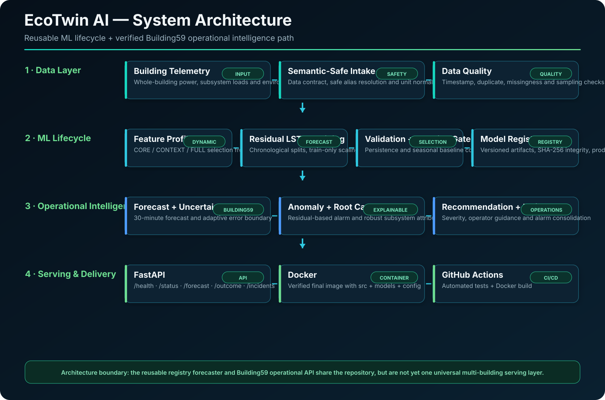
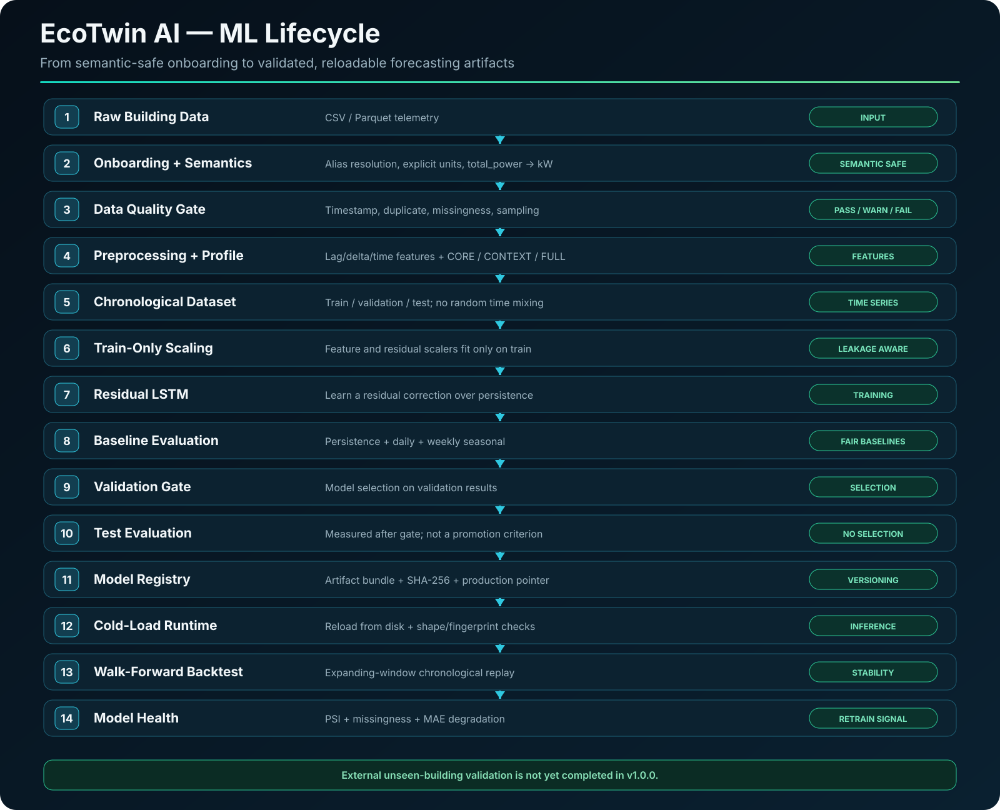
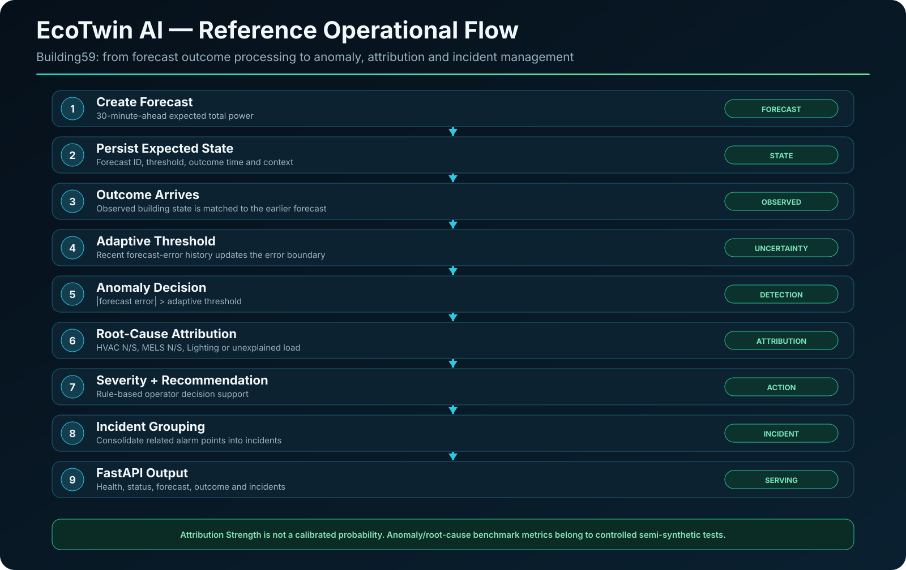

<div align="center">

# EcoTwin AI

### Production-Oriented Smart Building Energy Intelligence & ML Lifecycle

**Forecasting · Semantic Data Safety · Adaptive Uncertainty · Anomaly Detection · Root-Cause Attribution · Model Registry · Backtesting · Model Health**

[](https://github.com/MusaAlver/EcoTwinAI/actions/workflows/ci.yml)


**English** · [Türkçe](README_TR.md)

</div>

---

## What is EcoTwin AI?

**EcoTwin AI** is an end-to-end smart-building energy intelligence project that combines two complementary engineering layers:

1. a **verified Building59 operational intelligence backend** for forecasting, adaptive uncertainty, anomaly detection, root-cause attribution, recommendations and incident management; and
2. a **reusable machine-learning lifecycle** for semantic-safe data onboarding, chronological training, baseline-aware model selection, model registry, cold-load inference, walk-forward evaluation and model-health monitoring.

The project was deliberately evolved beyond a single forecasting notebook. It now contains explicit data contracts, testable production modules, versioned model artifacts, integrity checks, a REST API, Docker delivery and CI.

> **Scope boundary:** EcoTwin AI is production-oriented engineering work, not a field-validated commercial BMS product. External unseen-building validation has not yet been completed.

---

## System Architecture

<p align="center">
  
</p>

A key design choice is to keep the **reusable ML lifecycle** separate from the **reference Building59 operational path**. This avoids presenting a building-specific API as if it were already a universal multi-building serving layer.

---

## Why this is more than a forecasting demo

| Engineering area | Implemented capability |
|---|---|
| Semantic data safety | Contract-driven signal resolution and explicit power/energy unit rules |
| Data quality | Timestamp, duplicate, missingness, sampling and signal-health checks |
| Dynamic training | `CORE`, `CONTEXT`, `FULL` feature profiles selected from available signals |
| Time-series integrity | Chronological train/validation/test construction; no random future/past mixing |
| Leakage control | Feature and residual scalers fitted on training data only |
| Forecasting | Residual LSTM with persistence-based reconstruction |
| Baseline gate | Persistence, daily-seasonal and weekly-seasonal comparisons |
| Model registry | Versioned artifacts with SHA-256 integrity verification |
| Cold-load inference | Production-pointer model loading with contract/fingerprint/shape validation |
| Walk-forward evaluation | Expanding-window chronological backtesting engine |
| Model health | PSI, missingness and MAE-degradation indicators |
| Operational intelligence | Adaptive anomaly detection, root cause, recommendation and incidents |
| Serving | FastAPI reference service |
| Delivery | Docker + GitHub Actions CI |
| Verification | **155 automated tests passing** |

---

## ML Lifecycle

<p align="center">
  
</p>

### Semantic-safe onboarding

The onboarding layer does **not** silently assume that columns named `energy`, `electricity` and `power` represent the same physical quantity.

For canonical `total_power`:

- canonical unit: **kW**
- conservative safe aliases
- ambiguous aliases require confirmation
- supported power normalization: `W → kW`, `kW → kW`, `MW → kW`
- energy-to-power conversion requires an explicit interval and meter semantics
- cumulative-energy conversion rejects negative deltas instead of hiding a possible meter reset/rollover

This protects the training pipeline from a common failure mode: silently modeling semantically incompatible measurements.

### Data-quality gate

`BuildingDataQualityGate` checks timestamp parsing, duplicates, sampling consistency, usable duration, missingness, infinite values, negative-power warnings, constant signals and optional-signal missingness. It reports `PASS`, `WARN` or `FAIL`.

### Dynamic feature profiles

| Profile | Meaning |
|---|---|
| `CORE` | Whole-building power + historical/time-derived features |
| `CONTEXT` | CORE + any available subsystem and/or environmental context |
| `FULL` | CORE + complete reference root-cause subsystem coverage |

The exact feature list receives a deterministic fingerprint that is stored with the training metadata and checked again at runtime.

### Chronological dataset construction

Default forecasting setup:

```text
sampling interval : 15 minutes
lookback          : 16 timesteps
historical context: ~4 hours
forecast horizon  : 30 minutes
```

Train, validation and test sequences are built chronologically. Sequences that cross gaps or contain invalid values are skipped. Feature and residual scalers are fitted on the **training split only**.

### Residual LSTM trainer

The reusable trainer learns a correction over persistence:

```text
forecast = persistence + predicted_residual
```

Training uses stacked LSTM layers, dropout, a dense residual head, Adam, Huber loss, early stopping with best-weight restoration, deterministic seeds and `shuffle=False`.

The reusable trainer does **not** automatically reuse the Building59-specific `0.42` gate; that coefficient belongs only to the reference Building59 operational model.

### Validation and baseline gate

Candidate forecasts are compared against:

- persistence
- daily-seasonal baseline
- weekly-seasonal baseline

Promotion is based on **validation** performance and artifact integrity. Test metrics are evaluated after the validation gate accepts the candidate and are not used as the promotion criterion.

The trainer currently uses validation for both early stopping and promotion evaluation, so the validation period is not described as an untouched independent holdout.

---

## Model Registry & Cold-Load Runtime

Accepted models can be stored as versioned bundles containing the Keras model, feature scaler, residual scaler, feature contract, training configuration, history, metadata and integrity manifest.

The registry:

- copies artifacts into a versioned bundle
- computes SHA-256 hashes
- verifies artifact integrity
- maintains a production pointer
- archives the previous production version during promotion

`RegistryForecaster` verifies the manifest, feature contract, feature fingerprint, model input shape and numeric inputs before reconstructing forecasts.

A manual smoke test also verified that a freshly trained registered model could be loaded from disk repeatedly and produce identical predictions.

---

## Walk-Forward Backtesting

`WalkForwardBacktester` provides expanding-window chronological replay for stability analysis.

```text
train ──────────────────┐
                        ├── validation window 1
train + more history ───┤
                        ├── validation window 2
train + more history ───┤
                        └── ...
```

It checks fold chronology, prevents overlapping validation windows under the default configuration, compares candidates with aligned baselines and aggregates fold metrics.

The backtesting engine is available as a lifecycle component; it is **not** claimed to be an automatically mandatory promotion gate for every training run.

---

## Model Health

`ModelHealthMonitor` provides operational indicators for:

- PSI-based feature-distribution shift
- missingness increase
- constant/current-signal checks
- MAE degradation when reference performance is available

Default PSI thresholds:

```text
warning : 0.10
critical: 0.25
```

PSI is treated as an **operational shift indicator**, not calibrated proof of data drift. Health states are `HEALTHY`, `WARNING` and `CRITICAL`; critical health can mark retraining as recommended.

---

## Reference Dataset & Data Preparation

The reference operational system uses the **Building 59 Operational Performance Dataset** from Kaggle:

**Dataset:** https://www.kaggle.com/datasets/gideonkipkorir/building-operational-performance

The raw dataset is intentionally not included in this repository.

The reference preparation pipeline keeps measurements in chronological order, builds the 15-minute time-series structure and derives historical and temporal features such as:

```text
power_lag_15m       power_lag_60m
power_lag_24h       power_lag_7d
power_delta_15m     power_delta_60m
time_sin            time_cos
dow_sin             dow_cos
is_weekend
```

The verified Building59 operational model uses:

```text
16 timesteps × 23 features
15-minute sampling
~4 hours of historical context
30-minute forecast horizon
```

---

## Reference Building59 Forecasting Model

The Building59 operational path uses a **Gated Residual LSTM**:

```text
forecast = persistence + 0.42 × predicted_residual
```

### Forecast performance

| Metric | Result |
|---|---:|
| MAE | **2.776 kW** |
| RMSE | **4.426 kW** |
| Within ±5 kW | **84.63%** |
| Within ±10 kW | **95.58%** |

**95.58% is a ±10 kW tolerance hit rate, not classification accuracy.**

The development test period has been inspected repeatedly during model development and is therefore not described as a permanently untouched holdout.

For the 60-minute horizon, persistence slightly outperformed the tested ML alternative and is retained as the production choice for that horizon.

---

## Adaptive Uncertainty & Anomaly Detection

The reference operational path maintains a rolling adaptive uncertainty boundary based on recent forecast errors rather than one fixed global threshold.

Reference configuration includes:

- target coverage: **96%**
- rolling calibration horizon: **30 days**
- rolling window: **672 observations**
- delayed forecast-outcome updates
- leakage-aware calibration updates
- clipped anomaly errors before calibration-history updates

```text
anomaly_score = absolute_forecast_error / adaptive_threshold
```

An alarm is generated when:

```text
absolute_forecast_error > adaptive_threshold
```

### Controlled semi-synthetic anomaly benchmark

| Metric | Result |
|---|---:|
| Precision | **91.92%** |
| Recall | **68.68%** |
| F1 Score | **78.62%** |
| Accuracy | **81.32%** |

These metrics belong specifically to a **controlled semi-synthetic benchmark** and must not be interpreted as field-labeled real-building anomaly accuracy.

Reference operational alarm rate: **6.70%**. This is an alarm rate, **not a false-positive rate**.

---

## Root-Cause Attribution

Reference subsystem coverage:

- HVAC North
- HVAC South
- MELS North
- MELS South
- Lighting

Expected subsystem behavior is estimated from local historical context using robust statistics such as the median and MAD-based scale.

The module reports **Attribution Strength**, which is not presented as a calibrated confidence probability.

### Controlled semi-synthetic root-cause benchmark

| Metric | Result |
|---|---:|
| Correct cause among detected injected anomalies | **89.75%** |
| End-to-end detection + correct cause | **68.97%** |

These results are based on controlled semi-synthetic subsystem anomaly injections.

---

## Operational Intelligence Flow

<p align="center">
  
</p>

The recommendation layer is rule-based decision support. It combines anomaly severity, consumption direction, attributed subsystem and Attribution Strength to produce operator-oriented guidance.

Severity levels:

```text
NORMAL
WARNING
HIGH
CRITICAL
```

Related alarms are consolidated into higher-level incidents. In the reference evaluation:

```text
886 alarm points
      ↓
602 incidents
```

This is approximately a **32% reduction** in alert volume. Among explained incidents, approximately **84.8%** achieved mean Attribution Strength of at least 60%; this is not a calibrated confidence statistic.

---

## REST API

Reference Building59 endpoints:

```text
GET  /health
GET  /status
POST /forecast
POST /outcome
GET  /incidents
```

Interactive documentation:

```text
http://localhost:8000/docs
```

Example health response:

```json
{
  "status": "ok",
  "service": "EcoTwin AI",
  "version": "1.0.0",
  "engine_loaded": true,
  "initialized": true
}
```

> The reusable registry-based per-building forecaster exists as a runtime library component; it is not claimed to be automatically wired into every endpoint of the Building59 reference API.

---

## Quick Start

### Install dependencies

```bash
python -m pip install -r requirements-api.txt
```

### Run tests

```bash
python -m pytest tests/ -q
```

Current verified local suite:

```text
155 passed
```

### Run the API

```bash
uvicorn src.api:app --host 0.0.0.0 --port 8000
```

Then open `http://localhost:8000/docs`.

---

## Docker

Build:

```bash
docker build -t ecotwin-ai:1.0.0 .
```

Run:

```bash
docker run -d \
  --name ecotwin-api \
  -p 8000:8000 \
  ecotwin-ai:1.0.0
```

The final image includes `src/`, `models/` and `config/`.

Verified final-container smoke checks:

```text
/health                         OK
/status                         OK
building_data_contract v1.1     OK
semantic safety contract        OK
Pro lifecycle module imports    OK
```

---

## Automated Testing

The **155-test** suite covers both the reference operational intelligence path and the reusable ML lifecycle.

Major areas include forecasting, uncertainty, anomaly detection, root-cause attribution, recommendations, incidents, integrated engine behavior, FastAPI, onboarding, preprocessing, data quality, semantic unit safety, chronological datasets, baselines, model registry, training orchestration, dynamic profiles, production trainer, walk-forward backtesting, model health and registry-based cold-load forecasting.

---

## Continuous Integration

GitHub Actions runs on pushes and pull requests:

```text
Checkout repository
        ↓
Set up Python 3.13
        ↓
Install dependencies
        ↓
Run test suite
        ↓
Build Docker image
```

---

## Repository Structure

```text
EcoTwinAI/
│
├── .github/workflows/ci.yml
├── config/building_data_contract.json
├── docs/
│   ├── assets/
│   │   ├── system_architecture.svg
│   │   ├── system_architecture_tr.svg
│   │   ├── ml_lifecycle.svg
│   │   ├── ml_lifecycle_tr.svg
│   │   ├── operational_flow.svg
│   │   └── operational_flow_tr.svg
│   ├── engineering-decisions.md
│   └── experiment-notes.md
├── models/
├── reports/
├── src/
│   ├── forecast.py
│   ├── uncertainty.py
│   ├── anomaly.py
│   ├── root_cause.py
│   ├── recommendation.py
│   ├── incidents.py
│   ├── engine.py
│   ├── runtime.py
│   ├── api.py
│   ├── onboarding.py
│   ├── preprocessing.py
│   ├── data_quality.py
│   ├── semantics.py
│   ├── intake.py
│   ├── training_profiles.py
│   ├── training_data.py
│   ├── baselines.py
│   ├── model_registry.py
│   ├── training_orchestrator.py
│   ├── trainer.py
│   ├── backtesting.py
│   ├── model_health.py
│   └── registry_forecast.py
├── tests/
├── Dockerfile
├── requirements-api.txt
├── requirements.txt
├── README.md
└── README_TR.md
```

Raw/local datasets are intentionally excluded from Git tracking.

---

## Engineering Decisions

Detailed trade-offs and experiment notes are kept separately:

- [Engineering Decisions](docs/engineering-decisions.md)
- [Experiment Notes](docs/experiment-notes.md)

---

## Technology Stack

**ML & data:** Python · TensorFlow/Keras · NumPy · Pandas · scikit-learn · joblib
**Backend:** FastAPI · Pydantic · Uvicorn
**Quality:** Pytest
**Delivery:** Docker · GitHub Actions
**Artifact integrity:** JSON manifests · SHA-256 verification

---

## Scientific & Engineering Limitations

EcoTwin AI intentionally documents what has **not** yet been proven:

- reference performance focuses on one primary building dataset
- external unseen-building validation has not yet been completed
- the Building59 development test period has been inspected during development
- anomaly and root-cause benchmark metrics use controlled semi-synthetic injections
- reference root-cause coverage is limited to five primary subsystem categories
- dynamic feature profiles are selected from signal availability, not learned signal usefulness
- optional subsystem/environment unit normalization is less general than total-power normalization
- timezone/DST handling is not yet generalized for arbitrary deployments
- the reusable registry forecaster and Building59 operational API are not yet one universal multi-building serving layer
- walk-forward evaluation is reusable but not automatically mandatory for every promotion
- PSI is an operational indicator, not calibrated proof of drift
- persistent incident storage and a live dashboard are not part of v1.0.0

These limitations are stated to keep verified engineering behavior separate from future product claims.

---

## Roadmap

- external validation on unseen buildings
- multi-building benchmarking
- generalized subsystem/environment unit contracts
- robust timezone/DST normalization
- unified multi-building serving layer
- persistent incident/event storage
- live operational dashboard
- richer digital-twin context
- cloud deployment and observability

---

## Goal

EcoTwin AI explores how time-series forecasting, semantic data safety and operational decision-support can be combined into a reproducible smart-building intelligence system.

The goal is not only to predict future power consumption, but to transform telemetry into **detectable, explainable and actionable operational information** while preserving clear evaluation boundaries and reproducibility.

---

## Author

**Muhammed Musa Alver**
GitHub: [@MusaAlver](https://github.com/MusaAlver)
