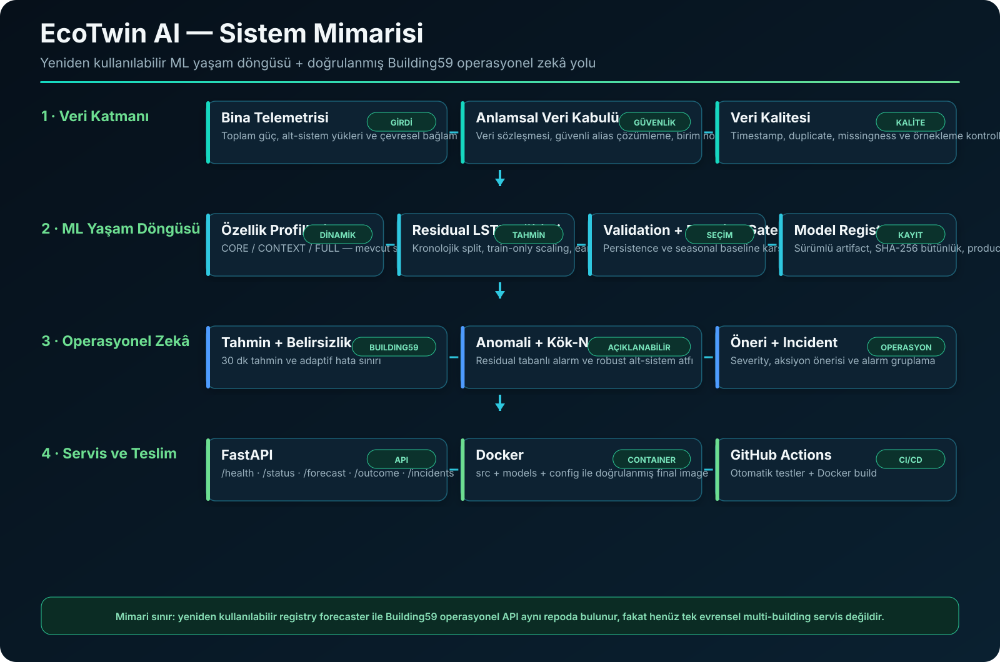
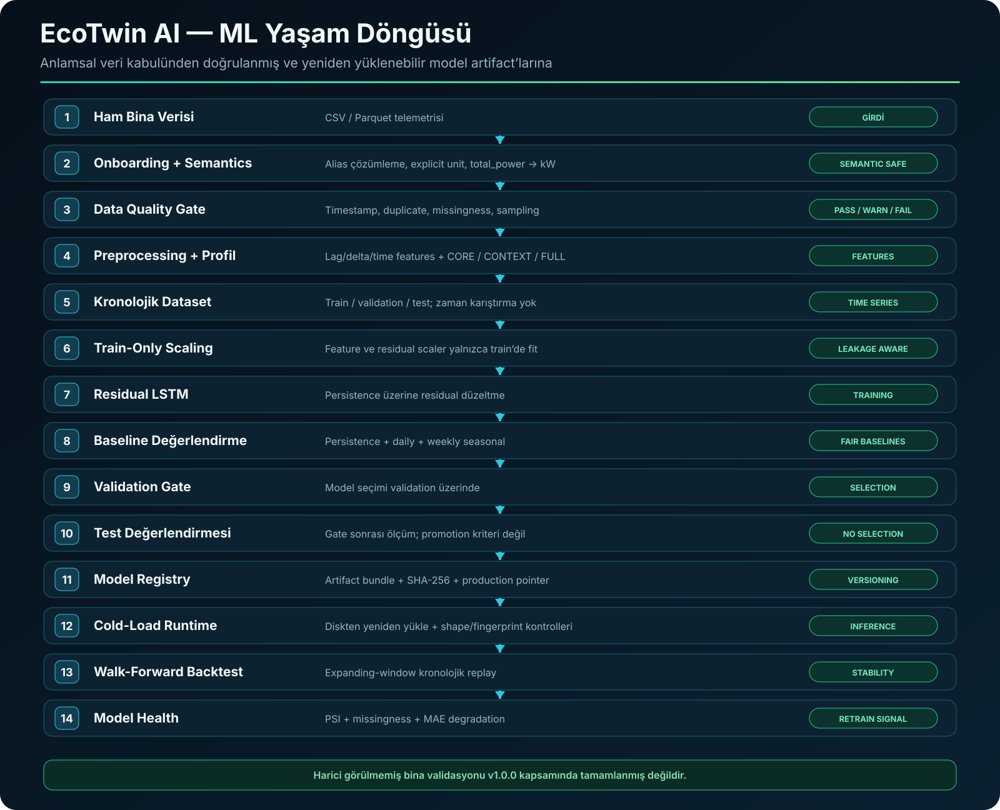
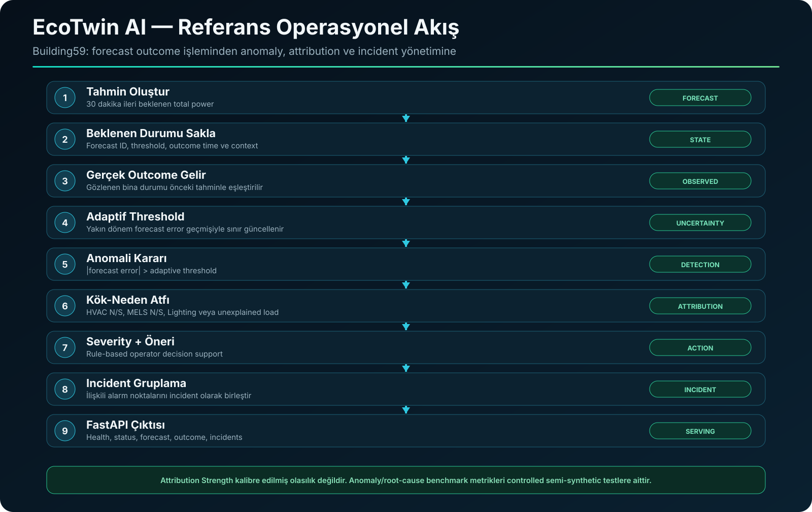

<div align="center">

# EcoTwin AI

### Üretim Odaklı Akıllı Bina Enerji Zekâsı ve ML Yaşam Döngüsü

**Tahminleme · Anlamsal Veri Güvenliği · Adaptif Belirsizlik · Anomali Tespiti · Kök-Neden Atfı · Model Registry · Backtesting · Model Sağlığı**

[](https://github.com/MusaAlver/EcoTwinAI/actions/workflows/ci.yml)


[English](README.md) · **Türkçe**

</div>

---

## EcoTwin AI Nedir?

**EcoTwin AI**, iki tamamlayıcı mühendislik katmanını aynı projede birleştiren uçtan uca bir akıllı bina enerji zekâsı çalışmasıdır:

1. Building59 referans veri seti için **doğrulanmış operasyonel zekâ backend'i** — tahminleme, adaptif belirsizlik, anomali tespiti, kök-neden atfı, öneri üretimi ve incident yönetimi;
2. farklı bina verilerinin sisteme alınması, model eğitimi, değerlendirme, sürümleme, yeniden yükleme ve model sağlığı takibi için **yeniden kullanılabilir ML yaşam döngüsü**.

Proje bilinçli olarak tek bir forecasting notebook'unun ötesine taşındı. Veri sözleşmeleri, test edilebilir modüller, sürümlü model artifact'ları, bütünlük kontrolleri, REST API, Docker dağıtımı ve CI projeye eklendi.

> **Kapsam sınırı:** EcoTwin AI üretim odaklı bir mühendislik/araştırma projesidir; sahada doğrulanmış ticari bir BMS ürünü olarak sunulmamaktadır. Harici görülmemiş binalarda doğrulama henüz tamamlanmamıştır.

---

## Sistem Mimarisi

<p align="center">
  
</p>

Temel tasarım kararlarından biri **yeniden kullanılabilir ML yaşam döngüsünü**, **Building59 referans operasyonel akışından** açık biçimde ayırmaktır. Böylece bina-özel bir API sanki şimdiden evrensel bir multi-building servis katmanıymış gibi sunulmaz.

---

## Neden yalnızca bir tahmin demosu değil?

| Mühendislik alanı | Uygulanan yetenek |
|---|---|
| Anlamsal veri güvenliği | Sözleşme tabanlı sinyal çözümleme ve açık güç/enerji birim kuralları |
| Veri kalitesi | Timestamp, duplicate, missingness, sampling ve sinyal sağlığı kontrolleri |
| Dinamik eğitim | Mevcut sinyallere göre `CORE`, `CONTEXT`, `FULL` profilleri |
| Zaman serisi bütünlüğü | Kronolojik train/validation/test; gelecek-geçmiş random karıştırma yok |
| Leakage kontrolü | Feature ve residual scaler yalnızca train verisinde fit edilir |
| Tahminleme | Persistence tabanlı residual LSTM |
| Baseline gate | Persistence, günlük-seasonal ve haftalık-seasonal karşılaştırmalar |
| Model registry | SHA-256 bütünlük doğrulamalı sürümlü artifact paketleri |
| Cold-load inference | Production-pointer yükleme + contract/fingerprint/shape doğrulaması |
| Walk-forward | Expanding-window kronolojik backtesting |
| Model sağlığı | PSI, missingness ve MAE bozulma göstergeleri |
| Operasyonel zekâ | Adaptif anomali, kök-neden, öneri ve incident yönetimi |
| Servis | FastAPI referans servisi |
| Teslim | Docker + GitHub Actions CI |
| Doğrulama | **155 otomatik test başarılı** |

---

## ML Yaşam Döngüsü

<p align="center">
  
</p>

### Anlamsal olarak güvenli veri kabulü

Onboarding katmanı `energy`, `electricity` ve `power` isimli her kolonun aynı fiziksel büyüklüğü temsil ettiğini sessizce varsaymaz.

Kanonik `total_power` için:

- kanonik birim **kW**
- güvenli alias listesi bilinçli olarak sınırlıdır
- belirsiz alias'lar onay gerektirir
- güç dönüşümleri: `W → kW`, `kW → kW`, `MW → kW`
- enerji → güç dönüşümü yalnızca interval süresi ve sayaç semantiği açıkça biliniyorsa yapılır
- kümülatif enerji farkında negatif değer görülürse olası sayaç reset/rollover durumu gizlenmez

Bu yaklaşım, enerji ML projelerindeki kritik bir hatayı engellemeyi hedefler: semantik olarak uyumsuz verilerle farkında olmadan model eğitmek.

### Veri kalite kapısı

`BuildingDataQualityGate`; timestamp parse, duplicate kayıtlar, sampling tutarlılığı, kullanılabilir süre, missingness, infinite değerler, negatif güç uyarıları, constant signal ve opsiyonel sinyal eksikliklerini kontrol eder. Sonuç `PASS`, `WARN` veya `FAIL` olarak raporlanır.

### Dinamik özellik profilleri

| Profil | Anlamı |
|---|---|
| `CORE` | Bina toplam gücü + geçmiş/zaman türetilmiş özellikleri |
| `CONTEXT` | CORE + mevcut alt-sistem ve/veya çevresel bağlam |
| `FULL` | CORE + referans root-cause alt-sistem setinin tamamı |

Seçilen feature listesi deterministic bir fingerprint alır; bu değer training metadata'sına yazılır ve runtime sırasında tekrar doğrulanır.

### Kronolojik dataset oluşturma

Varsayılan yapı:

```text
sampling interval : 15 dakika
lookback          : 16 timestep
geçmiş bağlam     : ~4 saat
tahmin ufku       : 30 dakika
```

Train, validation ve test sequence'leri kronolojik hazırlanır. Veri boşluklarını aşan veya geçersiz değer içeren sequence'ler atlanır. Feature ve residual scaler'lar yalnızca **train split** üzerinde fit edilir.

### Residual LSTM trainer

Yeniden kullanılabilir trainer persistence tahmini üzerine residual düzeltme öğrenir:

```text
forecast = persistence + predicted_residual
```

Training; stacked LSTM, dropout, dense residual head, Adam, Huber loss, early stopping, best-weight restore, deterministic seed ve `shuffle=False` içerir.

Yeni bina trainer'ı Building59'a özel `0.42` katsayısını otomatik kullanmaz. `0.42` yalnızca referans Building59 operasyonel modeline aittir.

### Validation ve baseline gate

Aday model şu baseline'larla karşılaştırılır:

- persistence
- günlük seasonal
- haftalık seasonal

Promotion kararı **validation** performansına ve artifact bütünlüğüne göre verilir. Test metrikleri yalnızca validation gate kabulünden sonra ölçülür ve promotion kriteri olarak kullanılmaz.

Trainer validation split'i hem early stopping hem de promotion değerlendirmesinde kullandığı için validation dönemi “tamamen dokunulmamış bağımsız holdout” olarak tanımlanmaz.

---

## Model Registry ve Cold-Load Runtime

Kabul edilen modeller; Keras modeli, feature scaler, residual scaler, feature contract, training config, history, metadata ve bütünlük manifesti içeren sürümlü paketler halinde tutulabilir.

Registry:

- artifact'ları sürümlü bir bundle'a kopyalar
- SHA-256 hash hesaplar
- artifact bütünlüğünü doğrular
- production pointer tutar
- yeni promotion sırasında önceki production sürümünü arşivler

`RegistryForecaster`; manifest, feature contract, fingerprint, model input shape ve numeric input kontrollerinden sonra forecast reconstruction yapar.

Manuel smoke testte yeni eğitilmiş bir modelin diskten iki kez cold-load edilip aynı prediction'ı üretmesi de doğrulandı.

---

## Walk-Forward Backtesting

`WalkForwardBacktester`, expanding-window kronolojik replay sağlar:

```text
train ──────────────────┐
                        ├── validation window 1
train + daha çok geçmiş ┤
                        ├── validation window 2
train + daha çok geçmiş ┤
                        └── ...
```

Fold kronolojisini kontrol eder, varsayılan yapıda validation window overlap'ini engeller, aday modeli hizalanmış baseline'larla karşılaştırır ve fold metriklerini toplar.

Backtesting motoru yaşam döngüsünde kullanılabilir bir bileşendir; her training run için otomatik zorunlu promotion gate olduğu iddia edilmez.

---

## Model Sağlığı

`ModelHealthMonitor` şu operasyonel göstergeleri sağlar:

- PSI tabanlı feature distribution shift
- missingness artışı
- constant/current signal kontrolleri
- referans performans mevcutsa MAE degradation

Varsayılan PSI eşikleri:

```text
warning : 0.10
critical: 0.25
```

PSI, **operasyonel shift göstergesi** olarak kullanılır; kalibre edilmiş drift kanıtı değildir. Sağlık durumları `HEALTHY`, `WARNING`, `CRITICAL` olarak raporlanır ve kritik durumda retraining önerilebilir.

---

## Referans Veri Seti ve Hazırlık

Referans operasyonel sistem Kaggle'daki **Building 59 Operational Performance Dataset** verisini kullanır:

**Veri seti:** https://www.kaggle.com/datasets/gideonkipkorir/building-operational-performance

Ham veri repo içinde tutulmaz.

Referans preparation pipeline ölçümleri kronolojik sırada tutar, 15 dakikalık time-series yapısını oluşturur ve şu tarz historical/temporal özellikler üretir:

```text
power_lag_15m       power_lag_60m
power_lag_24h       power_lag_7d
power_delta_15m     power_delta_60m
time_sin            time_cos
dow_sin             dow_cos
is_weekend
```

Doğrulanmış Building59 operasyonel modeli:

```text
16 timestep × 23 feature
15 dakika sampling
~4 saat geçmiş bağlam
30 dakika tahmin ufku
```

---

## Referans Building59 Tahmin Modeli

Building59 operasyonel yolunda **Gated Residual LSTM** kullanılır:

```text
forecast = persistence + 0.42 × predicted_residual
```

### Tahmin performansı

| Metrik | Sonuç |
|---|---:|
| MAE | **2.776 kW** |
| RMSE | **4.426 kW** |
| ±5 kW içinde | **84.63%** |
| ±10 kW içinde | **95.58%** |

**95.58%, ±10 kW tolerance hit rate değeridir; classification accuracy değildir.**

Development test dönemi model geliştirme sürecinde birden fazla kez incelendiği için “kalıcı olarak untouched holdout” şeklinde sunulmaz.

60 dakikalık horizon'da persistence test edilen ML alternatifini az farkla geçtiği için o horizon için production seçimi persistence olarak bırakılmıştır.

---

## Adaptif Belirsizlik ve Anomali Tespiti

Referans operasyonel akış tek bir sabit global threshold yerine yakın dönem forecast error geçmişinden adaptif bir sınır üretir.

Referans yapı:

- target coverage: **96%**
- rolling calibration horizon: **30 gün**
- rolling window: **672 gözlem**
- delayed forecast-outcome updates
- leakage-aware calibration updates
- calibration geçmişine yazılmadan önce anomaly error clipping

```text
anomaly_score = absolute_forecast_error / adaptive_threshold
```

Alarm koşulu:

```text
absolute_forecast_error > adaptive_threshold
```

### Kontrollü semi-synthetic anomaly benchmark

| Metrik | Sonuç |
|---|---:|
| Precision | **91.92%** |
| Recall | **68.68%** |
| F1 Score | **78.62%** |
| Accuracy | **81.32%** |

Bu metrikler **controlled semi-synthetic benchmark** sonuçlarıdır; gerçek saha etiketli anomaly accuracy olarak yorumlanmamalıdır.

Referans operasyonel alarm oranı: **6.70%**. Bu değer **false-positive rate değildir**.

---

## Kök-Neden Atfı

Referans alt-sistem kapsamı:

- HVAC North
- HVAC South
- MELS North
- MELS South
- Lighting

Beklenen alt-sistem davranışı, lokal historical context ve median/MAD tabanlı robust istatistiklerle hesaplanır.

Modül **Attribution Strength** raporlar. Bu değer kalibre edilmiş confidence probability olarak sunulmaz.

### Kontrollü semi-synthetic root-cause benchmark

| Metrik | Sonuç |
|---|---:|
| Tespit edilen injected anomaly'lerde doğru neden | **89.75%** |
| Uçtan uca detection + doğru neden | **68.97%** |

Sonuçlar controlled semi-synthetic subsystem anomaly injection testlerine aittir.

---

## Operasyonel Zekâ Akışı

<p align="center">
  
</p>

Recommendation katmanı rule-based decision support'tur. Anomaly severity, consumption direction, attributed subsystem ve Attribution Strength bilgisini birleştirerek operatöre yönelik aksiyon üretir.

Severity seviyeleri:

```text
NORMAL
WARNING
HIGH
CRITICAL
```

İlişkili alarm noktaları incident'lara dönüştürülür. Referans değerlendirmede:

```text
886 alarm noktası
       ↓
602 incident
```

Bu, alarm hacminde yaklaşık **%32 azalma** sağlar. Explained incident'ların yaklaşık **%84.8**'inde mean Attribution Strength en az %60'tır; bu bir kalibre confidence metriği değildir.

---

## REST API

Building59 referans endpoint'leri:

```text
GET  /health
GET  /status
POST /forecast
POST /outcome
GET  /incidents
```

Interactive dokümantasyon:

```text
http://localhost:8000/docs
```

Örnek health cevabı:

```json
{
  "status": "ok",
  "service": "EcoTwin AI",
  "version": "1.0.0",
  "engine_loaded": true,
  "initialized": true
}
```

> Registry tabanlı yeniden kullanılabilir bina forecaster'ı runtime library component olarak mevcuttur; Building59 API'nin bütün endpoint'lerine otomatik bağlanmış evrensel multi-building servis olarak sunulmaz.

---

## Hızlı Başlangıç

### Dependency kurulumu

```bash
python -m pip install -r requirements-api.txt
```

### Testler

```bash
python -m pytest tests/ -q
```

Doğrulanmış local test sonucu:

```text
155 passed
```

### API'yi çalıştır

```bash
uvicorn src.api:app --host 0.0.0.0 --port 8000
```

Sonra `http://localhost:8000/docs` adresini aç.

---

## Docker

Build:

```bash
docker build -t ecotwin-ai:1.0.0 .
```

Run:

```bash
docker run -d \
  --name ecotwin-api \
  -p 8000:8000 \
  ecotwin-ai:1.0.0
```

Final image `src/`, `models/` ve `config/` içerir.

Doğrulanan container smoke kontrolleri:

```text
/health                         OK
/status                         OK
building_data_contract v1.1     OK
semantic safety contract        OK
Pro lifecycle module imports    OK
```

---

## Otomatik Testler

**155 testlik** suite hem referans operasyonel zekâ yolunu hem de yeniden kullanılabilir ML yaşam döngüsünü kapsar.

Ana test alanları: forecasting, uncertainty, anomaly detection, root-cause attribution, recommendation, incidents, integrated engine, FastAPI, onboarding, preprocessing, data quality, semantic unit safety, chronological datasets, baselines, model registry, training orchestration, dynamic profiles, production trainer, walk-forward backtesting, model health ve registry-based cold-load forecasting.

---

## Continuous Integration

GitHub Actions push ve pull request'lerde:

```text
Repository checkout
        ↓
Python 3.13 setup
        ↓
Dependency kurulumu
        ↓
Test suite
        ↓
Docker build
```

---

## Repo Yapısı

```text
EcoTwinAI/
│
├── .github/workflows/ci.yml
├── config/building_data_contract.json
├── docs/
│   ├── assets/
│   │   ├── system_architecture.svg
│   │   ├── system_architecture_tr.svg
│   │   ├── ml_lifecycle.svg
│   │   ├── ml_lifecycle_tr.svg
│   │   ├── operational_flow.svg
│   │   └── operational_flow_tr.svg
│   ├── engineering-decisions.md
│   └── experiment-notes.md
├── models/
├── reports/
├── src/
├── tests/
├── Dockerfile
├── requirements-api.txt
├── requirements.txt
├── README.md
└── README_TR.md
```

Ham/local dataset'ler bilinçli olarak Git takibinin dışında tutulur.

---

## Mühendislik Kararları

Trade-off'lar ve deney notları ayrı dokümanlarda tutulur:

- [Engineering Decisions](docs/engineering-decisions.md)
- [Experiment Notes](docs/experiment-notes.md)

---

## Teknoloji Yığını

**ML & veri:** Python · TensorFlow/Keras · NumPy · Pandas · scikit-learn · joblib
**Backend:** FastAPI · Pydantic · Uvicorn
**Kalite:** Pytest
**Teslim:** Docker · GitHub Actions
**Artifact bütünlüğü:** JSON manifest · SHA-256 doğrulama

---

## Bilimsel ve Mühendislik Sınırlamaları

EcoTwin AI, henüz **kanıtlanmamış** noktaları açık biçimde yazar:

- referans performans tek bir ana bina veri setine odaklanır
- görülmemiş harici binalarda validasyon henüz tamamlanmamıştır
- Building59 development test dönemi geliştirme sırasında incelenmiştir
- anomaly ve root-cause benchmark'ları controlled semi-synthetic injection kullanır
- referans root-cause kapsamı beş ana alt-sistem kategorisiyle sınırlıdır
- dynamic feature profilleri signal availability üzerinden seçilir; feature usefulness öğrenilmez
- opsiyonel alt-sistem/çevre birim normalizasyonu `total_power` kadar genel değildir
- timezone/DST yönetimi arbitrary deployment için henüz genelleştirilmemiştir
- registry forecaster ve Building59 API henüz tek evrensel multi-building serving layer değildir
- walk-forward reusable'dır ancak her promotion için otomatik zorunlu değildir
- PSI operasyonel göstergedir; kalibre edilmiş drift kanıtı değildir
- persistent incident storage ve live dashboard v1.0.0 kapsamına dahil değildir

Bu sınırlar, doğrulanmış mühendislik davranışı ile gelecek ürün iddialarını birbirinden ayırmak için bilinçli olarak belirtilir.

---

## Yol Haritası

- unseen building external validation
- multi-building benchmark
- generalized subsystem/environment unit contracts
- robust timezone/DST normalization
- unified multi-building serving layer
- persistent incident/event storage
- live operational dashboard
- richer digital-twin context
- cloud deployment + observability

---

## Amaç

EcoTwin AI; time-series forecasting, anlamsal veri güvenliği ve operasyonel decision-support bileşenlerinin yeniden üretilebilir bir akıllı bina enerji zekâ sisteminde nasıl birleştirilebileceğini araştırır.

Amaç yalnızca gelecekteki güç tüketimini tahmin etmek değil, telemetriyi **tespit edilebilir, açıklanabilir ve aksiyona dönüştürülebilir operasyonel bilgiye** çevirmektir.

---

## Geliştirici

**Muhammed Musa Alver**
GitHub: [@MusaAlver](https://github.com/MusaAlver)
